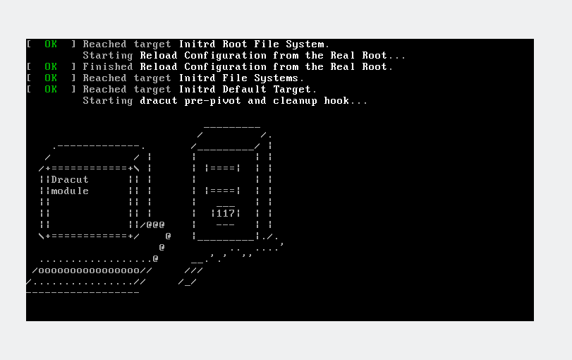

# Homework Linux №1

## Задание:
Создать dracut модуль который выводит сообщение при загрузке.

## Выполнение:

Для создания Dracut модуля необходмио создать папку для модуля в `/usr/lib/dracut/modules.d/<имя-модуля>` (01_test)

Затем там необходимо создать [test.sh](test.sh) и [module-setup.sh](module-setup.sh)

Дадим права на исполнение `chmod +x test.sh module-setup.sh`

Сгенерируем новый initramfs image 

`dracut /boot/newinitramfs.img`

Нужно сказать загрузчику что бы он использовал новый image, для это я поправил в файле `/boo/grub/grub.cfg` строку обращения к intrd

`initrd /boot/newinitramfs.img`

*Так как я редактировал конфиг граба, пересобирать конфиг не нужно, хотя лучше самому конфиг не редактировать, но разок можно.*

После перезагрузки увидим картиночку:

