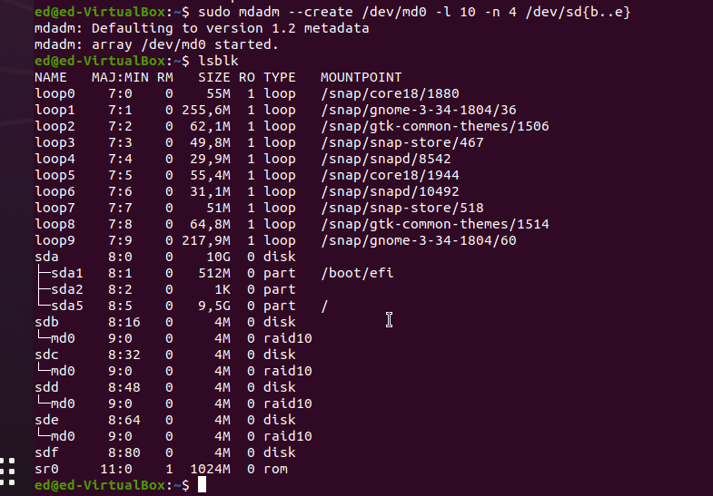
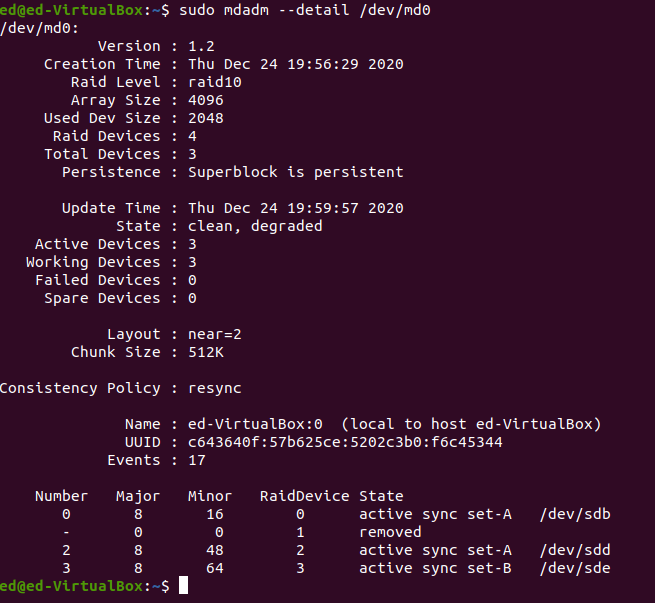
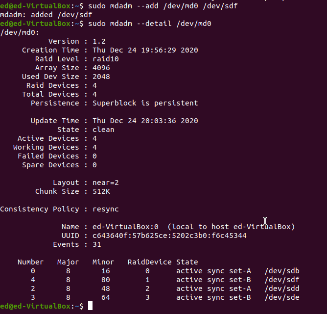
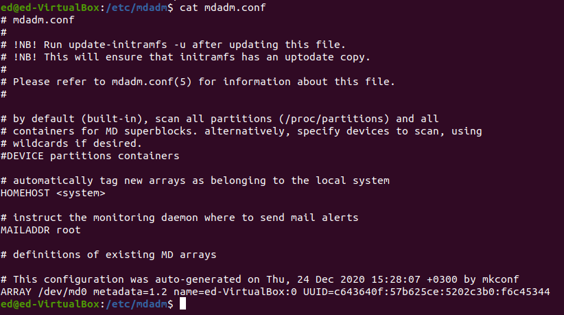
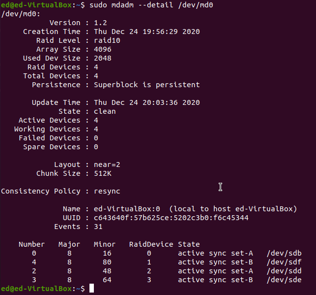
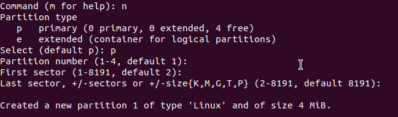
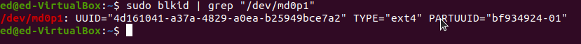
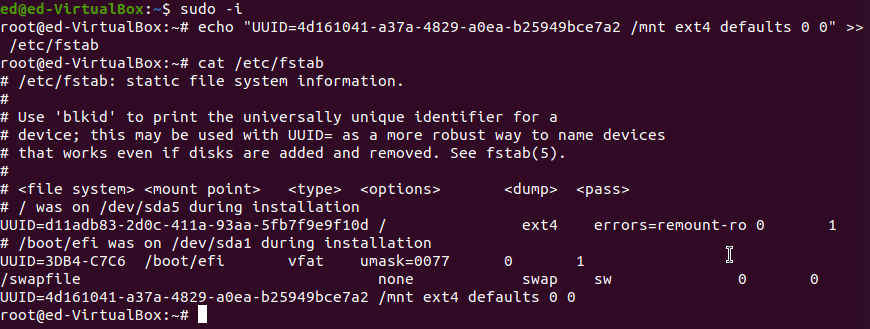
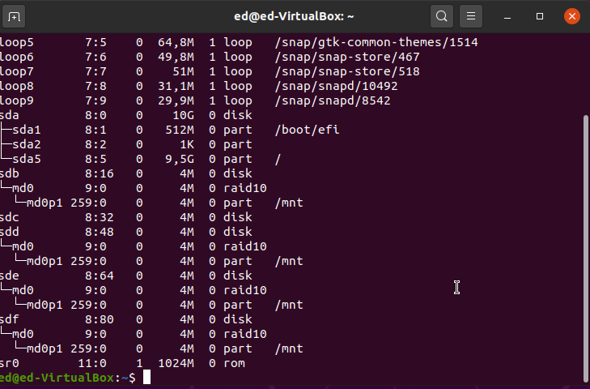

# Homework Linux №4

## Задание:

- [x] Cобрать R0/R5/R10 на выбор
- [x] Сломать и починить его;
- [x] Проверить, что он собирается при перезагрузке;
- [x] Cоздать на созданном RAID-устройстве раздел и файловую систему;
- [x] Добавить запись в fstab для автомонтирования при перезагрузке.

## Выполнение:

На ваиртуальной машине с Ubuntu была добавлено 5 дисков по 4! мб каждый.

В первую очередь надо обзавестись RAID массивом, реализовать буду RAID 10. Выбор на 10 пал по обьективным причинам его превосходства над 2 другими предложенными опциями (10 > 5 > 1).

*Да я знаю что это не десять, а один ноль.*

### Создание RAID10:

### Теперь убьем один диск тем самым добьемся ситуации когда один диску нас умер

Хорошо у нас был запасной диск который можно заменить мертвый

Теперь надо убедиться что бы RAID массив был после перезагрузке машины

Это выполняем через консоль супер-пользователя

`sudo mdadm  --detail --scan >> /etc/mdadm/mdadm.conf`

После ребута:

### Теперь нужно создать раздел и файлоыую систему.

Создаем раздел:

и файловую систему:

`sudo mkfs.ext4 /dev/md0p1`

перед добавлением записи в fstab нужно узнать UUID диска

Теперь обновим fstab:

Опять перезагружаем машину:

