# Homework Linux №5

## Задание:
Практика по lvm.

### Смотрим текущее состояние:

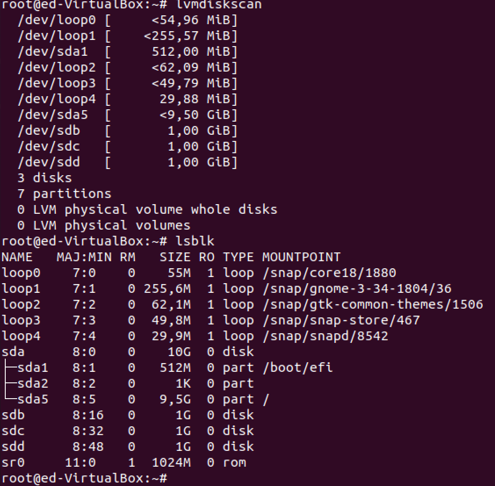

### Добавляем диск как PV:
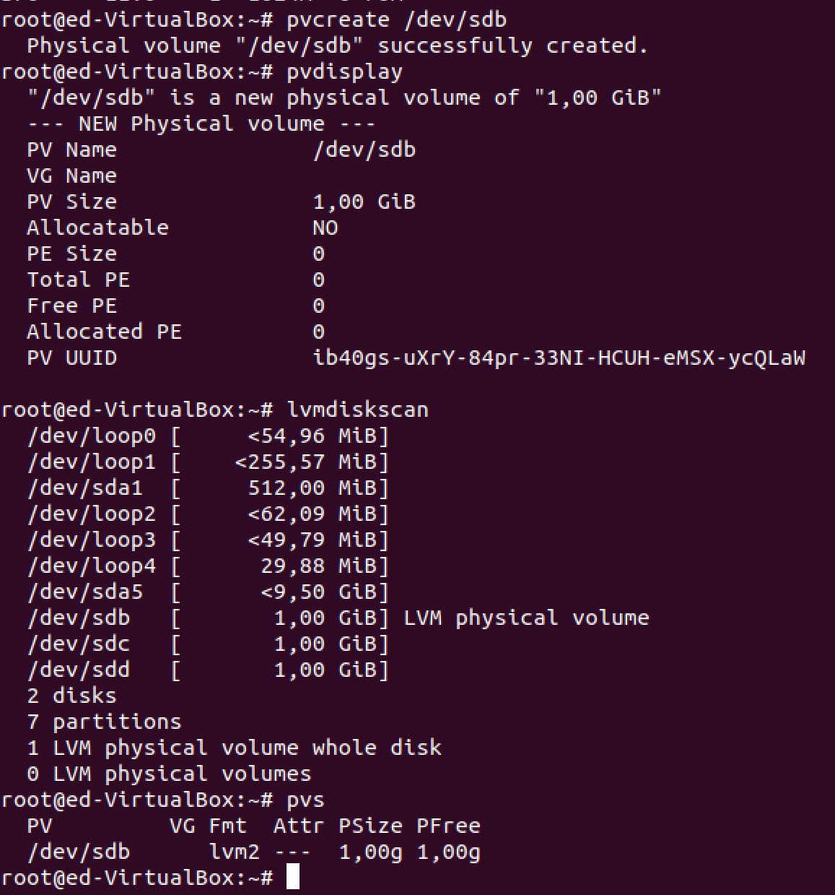

### Создаём VG на базе PV:

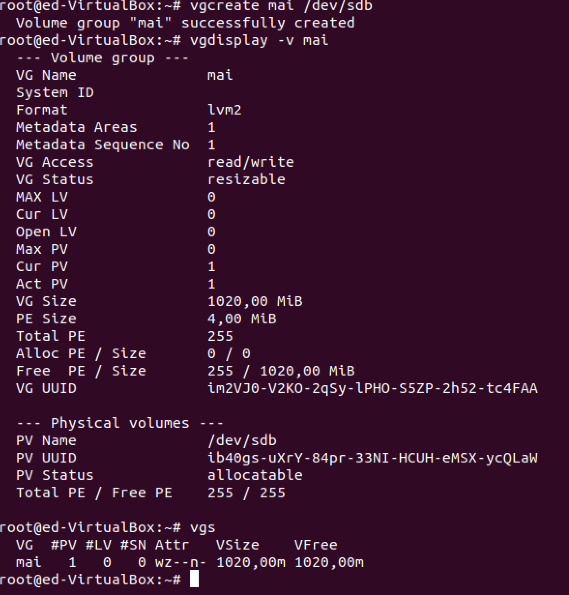

### Создаём LV на базе VG
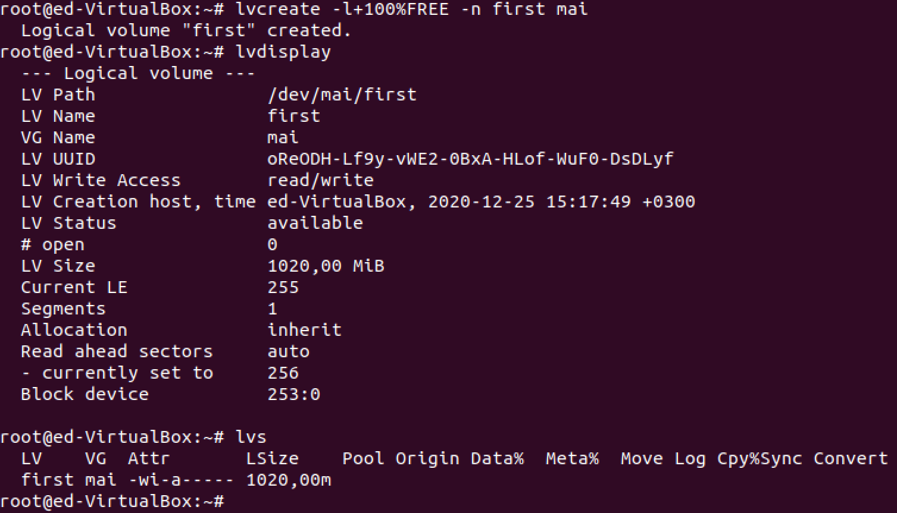

### Создаём файловую систему, монтируем её и проверяем
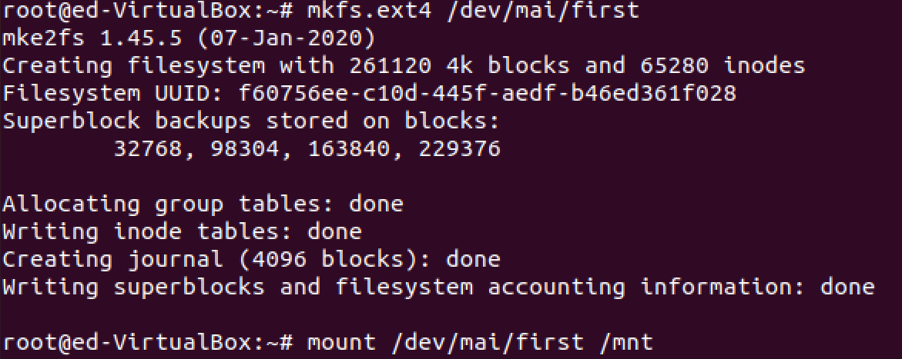

`mount` output:
```
sysfs on /sys type sysfs (rw,nosuid,nodev,noexec,relatime)
proc on /proc type proc (rw,nosuid,nodev,noexec,relatime)
udev on /dev type devtmpfs (rw,nosuid,noexec,relatime,size=987424k,nr_inodes=246856,mode=755)
devpts on /dev/pts type devpts (rw,nosuid,noexec,relatime,gid=5,mode=620,ptmxmode=000)
tmpfs on /run type tmpfs (rw,nosuid,nodev,noexec,relatime,size=203532k,mode=755)
/dev/sda5 on / type ext4 (rw,relatime,errors=remount-ro)
securityfs on /sys/kernel/security type securityfs (rw,nosuid,nodev,noexec,relatime)
tmpfs on /dev/shm type tmpfs (rw,nosuid,nodev)
tmpfs on /run/lock type tmpfs (rw,nosuid,nodev,noexec,relatime,size=5120k)
tmpfs on /sys/fs/cgroup type tmpfs (ro,nosuid,nodev,noexec,mode=755)
cgroup2 on /sys/fs/cgroup/unified type cgroup2 (rw,nosuid,nodev,noexec,relatime,nsdelegate)
cgroup on /sys/fs/cgroup/systemd type cgroup (rw,nosuid,nodev,noexec,relatime,xattr,name=systemd)
pstore on /sys/fs/pstore type pstore (rw,nosuid,nodev,noexec,relatime)
none on /sys/fs/bpf type bpf (rw,nosuid,nodev,noexec,relatime,mode=700)
cgroup on /sys/fs/cgroup/net_cls,net_prio type cgroup (rw,nosuid,nodev,noexec,relatime,net_cls,net_prio)
cgroup on /sys/fs/cgroup/memory type cgroup (rw,nosuid,nodev,noexec,relatime,memory)
cgroup on /sys/fs/cgroup/perf_event type cgroup (rw,nosuid,nodev,noexec,relatime,perf_event)
cgroup on /sys/fs/cgroup/rdma type cgroup (rw,nosuid,nodev,noexec,relatime,rdma)
cgroup on /sys/fs/cgroup/hugetlb type cgroup (rw,nosuid,nodev,noexec,relatime,hugetlb)
cgroup on /sys/fs/cgroup/devices type cgroup (rw,nosuid,nodev,noexec,relatime,devices)
cgroup on /sys/fs/cgroup/blkio type cgroup (rw,nosuid,nodev,noexec,relatime,blkio)
cgroup on /sys/fs/cgroup/cpu,cpuacct type cgroup (rw,nosuid,nodev,noexec,relatime,cpu,cpuacct)
cgroup on /sys/fs/cgroup/pids type cgroup (rw,nosuid,nodev,noexec,relatime,pids)
cgroup on /sys/fs/cgroup/cpuset type cgroup (rw,nosuid,nodev,noexec,relatime,cpuset)
cgroup on /sys/fs/cgroup/freezer type cgroup (rw,nosuid,nodev,noexec,relatime,freezer)
systemd-1 on /proc/sys/fs/binfmt_misc type autofs (rw,relatime,fd=28,pgrp=1,timeout=0,minproto=5,maxproto=5,direct,pipe_ino=14669)
hugetlbfs on /dev/hugepages type hugetlbfs (rw,relatime,pagesize=2M)
mqueue on /dev/mqueue type mqueue (rw,nosuid,nodev,noexec,relatime)
tracefs on /sys/kernel/tracing type tracefs (rw,nosuid,nodev,noexec,relatime)
debugfs on /sys/kernel/debug type debugfs (rw,nosuid,nodev,noexec,relatime)
configfs on /sys/kernel/config type configfs (rw,nosuid,nodev,noexec,relatime)
fusectl on /sys/fs/fuse/connections type fusectl (rw,nosuid,nodev,noexec,relatime)
/var/lib/snapd/snaps/core18_1880.snap on /snap/core18/1880 type squashfs (ro,nodev,relatime,x-gdu.hide)
/var/lib/snapd/snaps/gnome-3-34-1804_36.snap on /snap/gnome-3-34-1804/36 type squashfs (ro,nodev,relatime,x-gdu.hide)
/var/lib/snapd/snaps/gtk-common-themes_1506.snap on /snap/gtk-common-themes/1506 type squashfs (ro,nodev,relatime,x-gdu.hide)
/var/lib/snapd/snaps/snap-store_467.snap on /snap/snap-store/467 type squashfs (ro,nodev,relatime,x-gdu.hide)
/var/lib/snapd/snaps/snapd_8542.snap on /snap/snapd/8542 type squashfs (ro,nodev,relatime,x-gdu.hide)
/dev/sda1 on /boot/efi type vfat (rw,relatime,fmask=0077,dmask=0077,codepage=437,iocharset=iso8859-1,shortname=mixed,errors=remount-ro)
tmpfs on /run/user/1000 type tmpfs (rw,nosuid,nodev,relatime,size=203528k,mode=700,uid=1000,gid=1000)
gvfsd-fuse on /run/user/1000/gvfs type fuse.gvfsd-fuse (rw,nosuid,nodev,relatime,user_id=1000,group_id=1000)
/dev/fuse on /run/user/1000/doc type fuse (rw,nosuid,nodev,relatime,user_id=1000,group_id=1000)
/dev/mapper/mai-first on /mnt type ext4 (rw,relatime)
```

### Создаём файл на весь размер точки монтирования
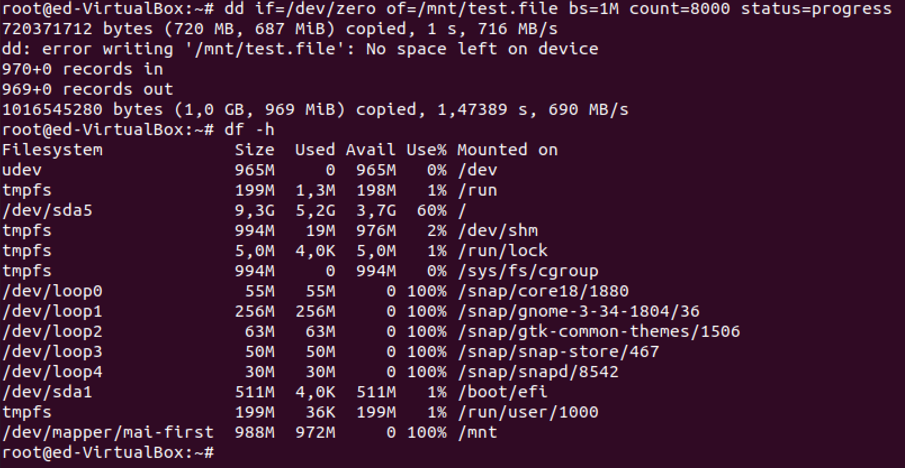

### Расширяем LV за счёт нового PV в VG
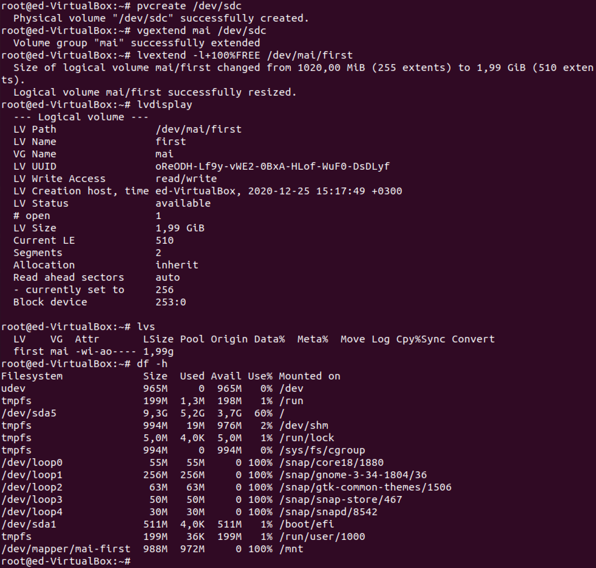

### Чуда не произошло, поэтому расширяем файловую систему
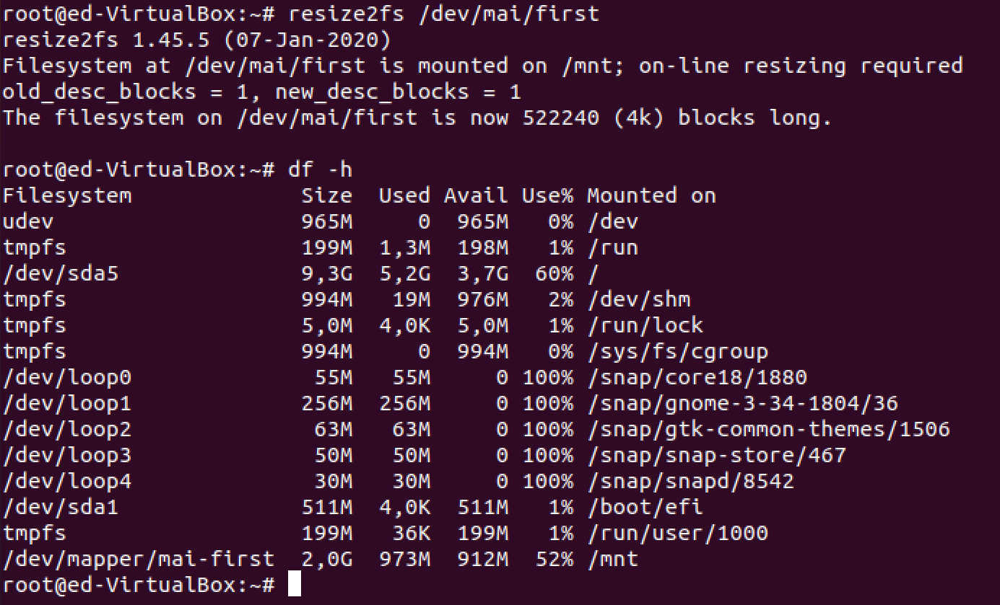

### Уменьшаем файловую систему и LV

*Здесь я чутка нафакапил с написанием по этому вывод текстом из консоли*
```
root@ed-VirtualBox:~# umount /mnt
root@ed-VirtualBox:~# e2fsck -fy /dev/mai/first
e2fsck 1.45.5 (07-Jan-2020)
Pass 1: Checking inodes, blocks, and sizes
Pass 2: Checking directory structure
Pass 3: Checking directory connectivity
Pass 4: Checking reference counts
Pass 5: Checking group summary information
/dev/mai/first: 12/130560 files (0.0% non-contiguous), 261249/522240 blocks

root@ed-VirtualBox:~# resize2fs /dev/mai/first 1800M
resize2fs 1.45.5 (07-Jan-2020)
Resizing the filesystem on /dev/mai/first to 460800 (4k) blocks.
The filesystem on /dev/mai/first is now 460800 (4k) blocks long.

root@ed-VirtualBox:~# lvreduce /dev/mai/first -L 1800M
  WARNING: Reducing active logical volume to <1,76 GiB.
  THIS MAY DESTROY YOUR DATA (filesystem etc.)
Do you really want to reduce mai/first? [y/n]: y
  Size of logical volume mai/first changed from 1,95 GiB (500 extents) to <1,76 GiB (450 extents).
  Logical volume mai/first successfully resized.
  
root@ed-VirtualBox:~# e2fsck -fy /dev/mai/first
e2fsck 1.45.5 (07-Jan-2020)
Pass 1: Checking inodes, blocks, and sizes
Pass 2: Checking directory structure
Pass 3: Checking directory connectivity
Pass 4: Checking reference counts
Pass 5: Checking group summary information
/dev/mai/first: 12/122400 files (0.0% non-contiguous), 260737/460800 blocks
root@ed-VirtualBox:~# mount /dev/mai/first /mnt

root@ed-VirtualBox:~# df -h
Filesystem             Size  Used Avail Use% Mounted on
udev                   965M     0  965M   0% /dev
tmpfs                  199M  1,3M  198M   1% /run
/dev/sda5              9,3G  5,2G  3,7G  60% /
tmpfs                  994M   21M  974M   3% /dev/shm
tmpfs                  5,0M  4,0K  5,0M   1% /run/lock
tmpfs                  994M     0  994M   0% /sys/fs/cgroup
/dev/loop0              55M   55M     0 100% /snap/core18/1880
/dev/loop1             256M  256M     0 100% /snap/gnome-3-34-1804/36
/dev/loop2              63M   63M     0 100% /snap/gtk-common-themes/1506
/dev/loop3              50M   50M     0 100% /snap/snap-store/467
/dev/loop4              30M   30M     0 100% /snap/snapd/8542
/dev/sda1              511M  4,0K  511M   1% /boot/efi
tmpfs                  199M   44K  199M   1% /run/user/1000
/dev/mapper/mai-first  1,8G  973M  685M  59% /mnt
```

### Создаём несколько файлов и делаем снимок
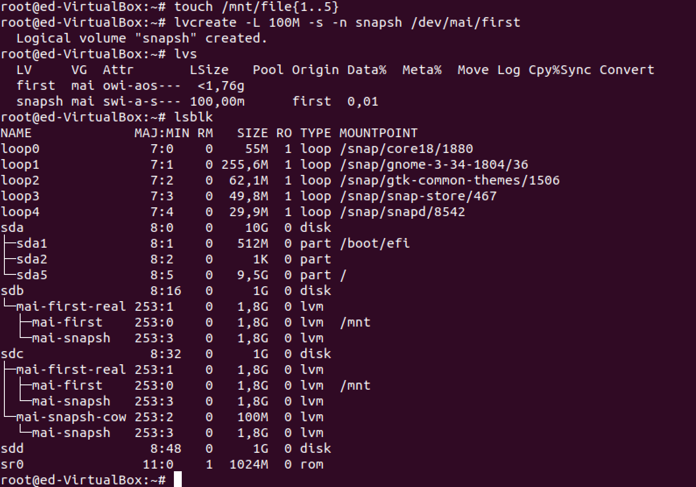

### Удаляем несколько файлов
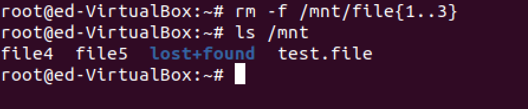

### Монтируем снимок и проверяем, что файлы там есть. Отмонтируем.
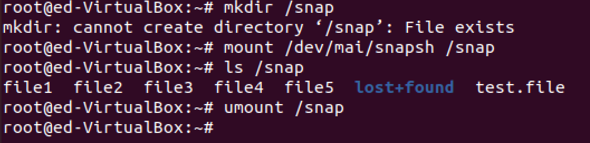

### Отмонтируем файловую систему и производим слияние. Проверяем, что файлы на месте.
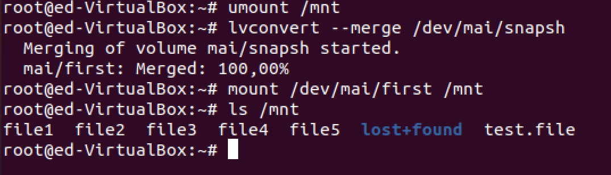

### Добавляем ещё PV, VG и создаём LV-зеркало.

Здесь я понял что у меня не хватает диска и я его добавил.
```
root@ed-VirtualBox:~# lvs
  LV    VG  Attr       LSize  Pool Origin Data%  Meta%  Move Log Cpy%Sync Convert
  first mai -wi-a----- <1,76g                                                    
root@ed-VirtualBox:~# lsblk 
NAME        MAJ:MIN RM   SIZE RO TYPE MOUNTPOINT
loop0         7:0    0    55M  1 loop /snap/core18/1880
loop1         7:1    0 255,6M  1 loop /snap/gnome-3-34-1804/36
loop2         7:2    0  29,9M  1 loop /snap/snapd/8542
loop3         7:3    0  62,1M  1 loop /snap/gtk-common-themes/1506
loop4         7:4    0  49,8M  1 loop /snap/snap-store/467
sda           8:0    0    10G  0 disk 
├─sda1        8:1    0   512M  0 part /boot/efi
├─sda2        8:2    0     1K  0 part 
└─sda5        8:5    0   9,5G  0 part /
sdb           8:16   0     1G  0 disk 
└─mai-first 253:0    0   1,8G  0 lvm  
sdc           8:32   0     1G  0 disk 
└─mai-first 253:0    0   1,8G  0 lvm  
sdd           8:48   0     1G  0 disk 
sde           8:64   0     1G  0 disk 
sr0          11:0    1  1024M  0 rom  

root@ed-VirtualBox:~# pvcreate /dev/sd{d,e}
  Can't initialize physical volume "/dev/sdd" of volume group "vgmirror" without -ff
  /dev/sdd: physical volume not initialized.
  Physical volume "/dev/sde" successfully created.

root@ed-VirtualBox:~# vgextend vgmirror /dev/sde
  Volume group "vgmirror" successfully extended

root@ed-VirtualBox:~# lvcreate -l+80%FREE -m1 -n mirror1 vgmirror
  Logical volume "mirror1" created.

root@ed-VirtualBox:~# lvs
  LV      VG       Attr       LSize   Pool Origin Data%  Meta%  Move Log Cpy%Sync Convert
  first   mai      -wi-a-----  <1,76g                                                    
  mirror1 vgmirror rwi-a-r--- 816,00m                                    100,00          

root@ed-VirtualBox:~# lsblk
NAME                        MAJ:MIN RM   SIZE RO TYPE MOUNTPOINT
loop0                         7:0    0    55M  1 loop /snap/core18/1880
loop1                         7:1    0 255,6M  1 loop /snap/gnome-3-34-1804/36
loop2                         7:2    0  29,9M  1 loop /snap/snapd/8542
loop3                         7:3    0  62,1M  1 loop /snap/gtk-common-themes/1506
loop4                         7:4    0  49,8M  1 loop /snap/snap-store/467
sda                           8:0    0    10G  0 disk 
├─sda1                        8:1    0   512M  0 part /boot/efi
├─sda2                        8:2    0     1K  0 part 
└─sda5                        8:5    0   9,5G  0 part /
sdb                           8:16   0     1G  0 disk 
└─mai-first                 253:0    0   1,8G  0 lvm  
sdc                           8:32   0     1G  0 disk 
└─mai-first                 253:0    0   1,8G  0 lvm  
sdd                           8:48   0     1G  0 disk 
├─vgmirror-mirror1_rmeta_0  253:1    0     4M  0 lvm  
│ └─vgmirror-mirror1        253:5    0   816M  0 lvm  
└─vgmirror-mirror1_rimage_0 253:2    0   816M  0 lvm  
  └─vgmirror-mirror1        253:5    0   816M  0 lvm  
sde                           8:64   0     1G  0 disk 
├─vgmirror-mirror1_rmeta_1  253:3    0     4M  0 lvm  
│ └─vgmirror-mirror1        253:5    0   816M  0 lvm  
└─vgmirror-mirror1_rimage_1 253:4    0   816M  0 lvm  
  └─vgmirror-mirror1        253:5    0   816M  0 lvm  
sr0                          11:0    1  1024M  0 rom  
root@ed-VirtualBox:~#
```


