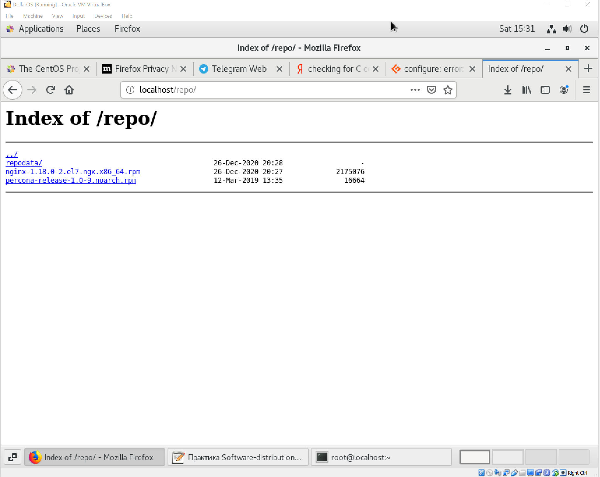

# Homework Linux №5

## Выполнение

### Ставим все необходимое:
```
[root@localhost ~]# yum install -y redhat-lsb-core wget rpmdevtools rpm-build createrepo yum-utils gcc
Loaded plugins: fastestmirror, langpacks
Loading mirror speeds from cached hostfile
 * base: mirror.reconn.ru
 * extras: mirror.reconn.ru
 * updates: mirror.reconn.ru
Package wget-1.14-18.el7_6.1.x86_64 already installed and latest version
Package createrepo-0.9.9-28.el7.noarch already installed and latest version
Package yum-utils-1.1.31-54.el7_8.noarch already installed and latest version
Resolving Dependencies
--> Running transaction check
---> Package redhat-lsb-core.x86_64 0:4.1-27.el7.centos.1 will be installed
--> Processing Dependency: redhat-lsb-submod-security(x86-64) = 4.1-27.el7.centos.1 for package: redhat-lsb-core-4.1-27.el7.centos.1.x86_64
--> Processing Dependency: spax for package: redhat-lsb-core-4.1-27.el7.centos.1.x86_64
--> Processing Dependency: /usr/bin/patch for package: redhat-lsb-core-4.1-27.el7.centos.1.x86_64
--> Processing Dependency: /usr/bin/m4 for package: redhat-lsb-core-4.1-27.el7.centos.1.x86_64
---> Package rpm-build.x86_64 0:4.11.3-45.el7 will be installed
--> Processing Dependency: system-rpm-config for package: rpm-build-4.11.3-45.el7.x86_64
--> Processing Dependency: perl(Thread::Queue) for package: rpm-build-4.11.3-45.el7.x86_64
---> Package rpmdevtools.noarch 0:8.3-8.el7_9 will be installed
--> Running transaction check
---> Package m4.x86_64 0:1.4.16-10.el7 will be installed
---> Package patch.x86_64 0:2.7.1-12.el7_7 will be installed
---> Package perl-Thread-Queue.noarch 0:3.02-2.el7 will be installed
---> Package redhat-lsb-submod-security.x86_64 0:4.1-27.el7.centos.1 will be installed
---> Package redhat-rpm-config.noarch 0:9.1.0-88.el7.centos will be installed
--> Processing Dependency: dwz >= 0.4 for package: redhat-rpm-config-9.1.0-88.el7.centos.noarch
--> Processing Dependency: python-srpm-macros for package: redhat-rpm-config-9.1.0-88.el7.centos.noarch
--> Processing Dependency: perl-srpm-macros for package: redhat-rpm-config-9.1.0-88.el7.centos.noarch
---> Package spax.x86_64 0:1.5.2-13.el7 will be installed
--> Running transaction check
---> Package dwz.x86_64 0:0.11-3.el7 will be installed
---> Package perl-srpm-macros.noarch 0:1-8.el7 will be installed
---> Package python-srpm-macros.noarch 0:3-34.el7 will be installed
--> Finished Dependency Resolution

Dependencies Resolved

================================================================================
 Package                      Arch     Version                  Repository
                                                                           Size
================================================================================
Installing:
 redhat-lsb-core              x86_64   4.1-27.el7.centos.1      base       38 k
 rpm-build                    x86_64   4.11.3-45.el7            base      149 k
 rpmdevtools                  noarch   8.3-8.el7_9              updates    97 k
Installing for dependencies:
 dwz                          x86_64   0.11-3.el7               base       99 k
 m4                           x86_64   1.4.16-10.el7            base      256 k
 patch                        x86_64   2.7.1-12.el7_7           base      111 k
 perl-Thread-Queue            noarch   3.02-2.el7               base       17 k
 perl-srpm-macros             noarch   1-8.el7                  base      4.6 k
 python-srpm-macros           noarch   3-34.el7                 base      8.8 k
 redhat-lsb-submod-security   x86_64   4.1-27.el7.centos.1      base       15 k
 redhat-rpm-config            noarch   9.1.0-88.el7.centos      base       81 k
 spax                         x86_64   1.5.2-13.el7             base      260 k

Transaction Summary
================================================================================
Install  3 Packages (+9 Dependent packages)

Total download size: 1.1 M
Installed size: 2.3 M
Downloading packages:
warning: /var/cache/yum/x86_64/7/base/packages/dwz-0.11-3.el7.x86_64.rpm: Header V3 RSA/SHA256 Signature, key ID f4a80eb5: NOKEY
Public key for dwz-0.11-3.el7.x86_64.rpm is not installed
(1/12): dwz-0.11-3.el7.x86_64.rpm                          |  99 kB   00:00     
(2/12): m4-1.4.16-10.el7.x86_64.rpm                        | 256 kB   00:00     
(3/12): patch-2.7.1-12.el7_7.x86_64.rpm                    | 111 kB   00:00     
(4/12): perl-Thread-Queue-3.02-2.el7.noarch.rpm            |  17 kB   00:00     
(5/12): perl-srpm-macros-1-8.el7.noarch.rpm                | 4.6 kB   00:00     
(6/12): python-srpm-macros-3-34.el7.noarch.rpm             | 8.8 kB   00:00     
(7/12): redhat-lsb-core-4.1-27.el7.centos.1.x86_64.rpm     |  38 kB   00:00     
(8/12): redhat-lsb-submod-security-4.1-27.el7.centos.1.x86 |  15 kB   00:00     
(9/12): redhat-rpm-config-9.1.0-88.el7.centos.noarch.rpm   |  81 kB   00:00     
(10/12): rpm-build-4.11.3-45.el7.x86_64.rpm                | 149 kB   00:00     
Public key for rpmdevtools-8.3-8.el7_9.noarch.rpm is not installed
(11/12): rpmdevtools-8.3-8.el7_9.noarch.rpm                |  97 kB   00:00     
(12/12): spax-1.5.2-13.el7.x86_64.rpm                      | 260 kB   00:00     
--------------------------------------------------------------------------------
Total                                              1.5 MB/s | 1.1 MB  00:00     
Retrieving key from file:///etc/pki/rpm-gpg/RPM-GPG-KEY-CentOS-7
Importing GPG key 0xF4A80EB5:
 Userid     : "CentOS-7 Key (CentOS 7 Official Signing Key) <security@centos.org>"
 Fingerprint: 6341 ab27 53d7 8a78 a7c2 7bb1 24c6 a8a7 f4a8 0eb5
 Package    : centos-release-7-9.2009.0.el7.centos.x86_64 (@anaconda)
 From       : /etc/pki/rpm-gpg/RPM-GPG-KEY-CentOS-7
Running transaction check
Running transaction test
Transaction test succeeded
Running transaction
  Installing : patch-2.7.1-12.el7_7.x86_64                                 1/12 
  Installing : m4-1.4.16-10.el7.x86_64                                     2/12 
  Installing : perl-Thread-Queue-3.02-2.el7.noarch                         3/12 
  Installing : dwz-0.11-3.el7.x86_64                                       4/12 
  Installing : spax-1.5.2-13.el7.x86_64                                    5/12 
  Installing : python-srpm-macros-3-34.el7.noarch                          6/12 
  Installing : perl-srpm-macros-1-8.el7.noarch                             7/12 
  Installing : redhat-rpm-config-9.1.0-88.el7.centos.noarch                8/12 
  Installing : rpm-build-4.11.3-45.el7.x86_64                              9/12 
  Installing : redhat-lsb-submod-security-4.1-27.el7.centos.1.x86_64      10/12 
  Installing : redhat-lsb-core-4.1-27.el7.centos.1.x86_64                 11/12 
  Installing : rpmdevtools-8.3-8.el7_9.noarch                             12/12 
  Verifying  : patch-2.7.1-12.el7_7.x86_64                                 1/12 
  Verifying  : rpm-build-4.11.3-45.el7.x86_64                              2/12 
  Verifying  : redhat-lsb-submod-security-4.1-27.el7.centos.1.x86_64       3/12 
  Verifying  : perl-srpm-macros-1-8.el7.noarch                             4/12 
  Verifying  : python-srpm-macros-3-34.el7.noarch                          5/12 
  Verifying  : spax-1.5.2-13.el7.x86_64                                    6/12 
  Verifying  : rpmdevtools-8.3-8.el7_9.noarch                              7/12 
  Verifying  : dwz-0.11-3.el7.x86_64                                       8/12 
  Verifying  : perl-Thread-Queue-3.02-2.el7.noarch                         9/12 
  Verifying  : redhat-lsb-core-4.1-27.el7.centos.1.x86_64                 10/12 
  Verifying  : m4-1.4.16-10.el7.x86_64                                    11/12 
  Verifying  : redhat-rpm-config-9.1.0-88.el7.centos.noarch               12/12 

Installed:
  redhat-lsb-core.x86_64 0:4.1-27.el7.centos.1 rpm-build.x86_64 0:4.11.3-45.el7
  rpmdevtools.noarch 0:8.3-8.el7_9            

Dependency Installed:
  dwz.x86_64 0:0.11-3.el7                                                       
  m4.x86_64 0:1.4.16-10.el7                                                     
  patch.x86_64 0:2.7.1-12.el7_7                                                 
  perl-Thread-Queue.noarch 0:3.02-2.el7                                         
  perl-srpm-macros.noarch 0:1-8.el7                                             
  python-srpm-macros.noarch 0:3-34.el7                                          
  redhat-lsb-submod-security.x86_64 0:4.1-27.el7.centos.1                       
  redhat-rpm-config.noarch 0:9.1.0-88.el7.centos                                
  spax.x86_64 0:1.5.2-13.el7                                                    

Complete!
```


### Загрузим SRPM пакет NGINX для дальнейшей работы над ним:
```
[root@localhost ~]# wget https://nginx.org/packages/centos/7/SRPMS/nginx-1.18.0-2.el7.ngx.src.rpm
--2020-12-26 14:55:32--  https://nginx.org/packages/centos/7/SRPMS/nginx-1.18.0-2.el7.ngx.src.rpm
Resolving nginx.org (nginx.org)... 52.58.199.22, 3.125.197.172, 2a05:d014:edb:5704::6, ...
Connecting to nginx.org (nginx.org)|52.58.199.22|:443... connected.
HTTP request sent, awaiting response... 200 OK
Length: 1055846 (1.0M) [application/x-redhat-package-manager]
Saving to: ‘nginx-1.18.0-2.el7.ngx.src.rpm’

100%[======================================>] 1,055,846   1.17MB/s   in 0.9s   

2020-12-26 14:55:34 (1.17 MB/s) - ‘nginx-1.18.0-2.el7.ngx.src.rpm’ saved [1055846/1055846]
```

### При установке такого пакета в домашней директории создается древо каталогов для сборки:
`[root@localhost ~]# rpm -i nginx-1.18.0-2.el7.ngx.src.rpm`

### Также нужно скачать и разархивировать последние исходники для openssl, т.к. они потребуется при сборке

```
[root@localhost ~]# wget https://www.openssl.org/source/latest.tar.gz
--2020-12-26 14:56:42--  https://www.openssl.org/source/latest.tar.gz
Resolving www.openssl.org (www.openssl.org)... 23.46.116.124, 2001:2030:21:1a3::c1e, 2001:2030:21:193::c1e
Connecting to www.openssl.org (www.openssl.org)|23.46.116.124|:443... connected.
HTTP request sent, awaiting response... 302 Moved Temporarily
Location: https://www.openssl.org/source/openssl-1.1.1i.tar.gz [following]
--2020-12-26 14:56:42--  https://www.openssl.org/source/openssl-1.1.1i.tar.gz
Reusing existing connection to www.openssl.org:443.
HTTP request sent, awaiting response... 200 OK
Length: 9808346 (9.4M) [application/x-gzip]
Saving to: ‘latest.tar.gz’

100%[======================================>] 9,808,346   2.70MB/s   in 3.5s   

2020-12-26 14:56:46 (2.68 MB/s) - ‘latest.tar.gz’ saved [9808346/9808346]

`[root@localhost ~]# tar -xvf latest.tar.gz`
```

### Заранее поставим все зависимости чтобы в процессе сборки не было ошибок:

```
[root@localhost ~]# yum-builddep rpmbuild/SPECS/nginx.spec
Loaded plugins: fastestmirror, langpacks
Enabling base-source repository
Enabling extras-source repository
Enabling updates-source repository
Loading mirror speeds from cached hostfile
 * base: mirrors.datahouse.ru
 * extras: mirror.docker.ru
 * updates: mirror.docker.ru
base-source                                              | 2.9 kB     00:00     
extras-source                                            | 2.9 kB     00:00     
updates-source                                           | 2.9 kB     00:00     
(1/3): updates-source/7/primary_db                         |  79 kB   00:00     
(2/3): extras-source/7/primary_db                          |  26 kB   00:00     
(3/3): base-source/7/primary_db                            | 974 kB   00:01     
Checking for new repos for mirrors
Getting requirements for rpmbuild/SPECS/nginx.spec
 --> Already installed : systemd-219-78.el7.x86_64
 --> 1:openssl-devel-1.0.2k-21.el7_9.x86_64
 --> zlib-devel-1.2.7-18.el7.x86_64
 --> pcre-devel-8.32-17.el7.x86_64
--> Running transaction check
---> Package openssl-devel.x86_64 1:1.0.2k-21.el7_9 will be installed
--> Processing Dependency: openssl-libs(x86-64) = 1:1.0.2k-21.el7_9 for package: 1:openssl-devel-1.0.2k-21.el7_9.x86_64
--> Processing Dependency: krb5-devel(x86-64) for package: 1:openssl-devel-1.0.2k-21.el7_9.x86_64
---> Package pcre-devel.x86_64 0:8.32-17.el7 will be installed
---> Package zlib-devel.x86_64 0:1.2.7-18.el7 will be installed
--> Running transaction check
---> Package krb5-devel.x86_64 0:1.15.1-50.el7 will be installed
--> Processing Dependency: libverto-devel for package: krb5-devel-1.15.1-50.el7.x86_64
--> Processing Dependency: libselinux-devel for package: krb5-devel-1.15.1-50.el7.x86_64
--> Processing Dependency: libcom_err-devel for package: krb5-devel-1.15.1-50.el7.x86_64
--> Processing Dependency: keyutils-libs-devel for package: krb5-devel-1.15.1-50.el7.x86_64
---> Package openssl-libs.x86_64 1:1.0.2k-19.el7 will be updated
--> Processing Dependency: openssl-libs(x86-64) = 1:1.0.2k-19.el7 for package: 1:openssl-1.0.2k-19.el7.x86_64
---> Package openssl-libs.x86_64 1:1.0.2k-21.el7_9 will be an update
--> Running transaction check
---> Package keyutils-libs-devel.x86_64 0:1.5.8-3.el7 will be installed
---> Package libcom_err-devel.x86_64 0:1.42.9-19.el7 will be installed
---> Package libselinux-devel.x86_64 0:2.5-15.el7 will be installed
--> Processing Dependency: libsepol-devel(x86-64) >= 2.5-10 for package: libselinux-devel-2.5-15.el7.x86_64
--> Processing Dependency: pkgconfig(libsepol) for package: libselinux-devel-2.5-15.el7.x86_64
---> Package libverto-devel.x86_64 0:0.2.5-4.el7 will be installed
---> Package openssl.x86_64 1:1.0.2k-19.el7 will be updated
---> Package openssl.x86_64 1:1.0.2k-21.el7_9 will be an update
--> Running transaction check
---> Package libsepol-devel.x86_64 0:2.5-10.el7 will be installed
--> Finished Dependency Resolution

Dependencies Resolved

================================================================================
 Package                  Arch        Version                Repository    Size
================================================================================
Installing:
 openssl-devel            x86_64      1:1.0.2k-21.el7_9      updates      1.5 M
 pcre-devel               x86_64      8.32-17.el7            base         480 k
 zlib-devel               x86_64      1.2.7-18.el7           base          50 k
Installing for dependencies:
 keyutils-libs-devel      x86_64      1.5.8-3.el7            base          37 k
 krb5-devel               x86_64      1.15.1-50.el7          base         273 k
 libcom_err-devel         x86_64      1.42.9-19.el7          base          32 k
 libselinux-devel         x86_64      2.5-15.el7             base         187 k
 libsepol-devel           x86_64      2.5-10.el7             base          77 k
 libverto-devel           x86_64      0.2.5-4.el7            base          12 k
Updating for dependencies:
 openssl                  x86_64      1:1.0.2k-21.el7_9      updates      493 k
 openssl-libs             x86_64      1:1.0.2k-21.el7_9      updates      1.2 M

Transaction Summary
================================================================================
Install  3 Packages (+6 Dependent packages)
Upgrade             ( 2 Dependent packages)

Total download size: 4.3 M
Is this ok [y/d/N]: y
Downloading packages:
No Presto metadata available for updates
(1/11): keyutils-libs-devel-1.5.8-3.el7.x86_64.rpm         |  37 kB   00:00     
(2/11): libcom_err-devel-1.42.9-19.el7.x86_64.rpm          |  32 kB   00:00     
(3/11): krb5-devel-1.15.1-50.el7.x86_64.rpm                | 273 kB   00:00     
(4/11): libsepol-devel-2.5-10.el7.x86_64.rpm               |  77 kB   00:00     
(5/11): libselinux-devel-2.5-15.el7.x86_64.rpm             | 187 kB   00:00     
(6/11): libverto-devel-0.2.5-4.el7.x86_64.rpm              |  12 kB   00:00     
(7/11): openssl-1.0.2k-21.el7_9.x86_64.rpm                 | 493 kB   00:00     
(8/11): openssl-devel-1.0.2k-21.el7_9.x86_64.rpm           | 1.5 MB   00:00     
(9/11): zlib-devel-1.2.7-18.el7.x86_64.rpm                 |  50 kB   00:00     
(10/11): pcre-devel-8.32-17.el7.x86_64.rpm                 | 480 kB   00:00     
(11/11): openssl-libs-1.0.2k-21.el7_9.x86_64.rpm           | 1.2 MB   00:00     
--------------------------------------------------------------------------------
Total                                              3.5 MB/s | 4.3 MB  00:01     
Running transaction check
Running transaction test
Transaction test succeeded
Running transaction
  Updating   : 1:openssl-libs-1.0.2k-21.el7_9.x86_64                       1/13 
  Installing : keyutils-libs-devel-1.5.8-3.el7.x86_64                      2/13 
  Installing : libcom_err-devel-1.42.9-19.el7.x86_64                       3/13 
  Installing : pcre-devel-8.32-17.el7.x86_64                               4/13 
  Installing : zlib-devel-1.2.7-18.el7.x86_64                              5/13 
  Installing : libverto-devel-0.2.5-4.el7.x86_64                           6/13 
  Installing : libsepol-devel-2.5-10.el7.x86_64                            7/13 
  Installing : libselinux-devel-2.5-15.el7.x86_64                          8/13 
  Installing : krb5-devel-1.15.1-50.el7.x86_64                             9/13 
  Installing : 1:openssl-devel-1.0.2k-21.el7_9.x86_64                     10/13 
  Updating   : 1:openssl-1.0.2k-21.el7_9.x86_64                           11/13 
  Cleanup    : 1:openssl-1.0.2k-19.el7.x86_64                             12/13 
  Cleanup    : 1:openssl-libs-1.0.2k-19.el7.x86_64                        13/13 
  Verifying  : libsepol-devel-2.5-10.el7.x86_64                            1/13 
  Verifying  : libselinux-devel-2.5-15.el7.x86_64                          2/13 
  Verifying  : 1:openssl-devel-1.0.2k-21.el7_9.x86_64                      3/13 
  Verifying  : libverto-devel-0.2.5-4.el7.x86_64                           4/13 
  Verifying  : zlib-devel-1.2.7-18.el7.x86_64                              5/13 
  Verifying  : pcre-devel-8.32-17.el7.x86_64                               6/13 
  Verifying  : libcom_err-devel-1.42.9-19.el7.x86_64                       7/13 
  Verifying  : krb5-devel-1.15.1-50.el7.x86_64                             8/13 
  Verifying  : 1:openssl-1.0.2k-21.el7_9.x86_64                            9/13 
  Verifying  : 1:openssl-libs-1.0.2k-21.el7_9.x86_64                      10/13 
  Verifying  : keyutils-libs-devel-1.5.8-3.el7.x86_64                     11/13 
  Verifying  : 1:openssl-1.0.2k-19.el7.x86_64                             12/13 
  Verifying  : 1:openssl-libs-1.0.2k-19.el7.x86_64                        13/13 

Installed:
  openssl-devel.x86_64 1:1.0.2k-21.el7_9     pcre-devel.x86_64 0:8.32-17.el7    
  zlib-devel.x86_64 0:1.2.7-18.el7          

Dependency Installed:
  keyutils-libs-devel.x86_64 0:1.5.8-3.el7 krb5-devel.x86_64 0:1.15.1-50.el7   
  libcom_err-devel.x86_64 0:1.42.9-19.el7  libselinux-devel.x86_64 0:2.5-15.el7
  libsepol-devel.x86_64 0:2.5-10.el7       libverto-devel.x86_64 0:0.2.5-4.el7 

Dependency Updated:
  openssl.x86_64 1:1.0.2k-21.el7_9     openssl-libs.x86_64 1:1.0.2k-21.el7_9    

Complete!
```

### Правим spec файл что бы Nginx собирался с OpenSSL
Less'ом показываю что внутри после редактирования:
`vim rpmbuild/SPECS/nginx.spec`
```
%build
./configure %{BASE_CONFIGURE_ARGS} \
    --with-cc-opt="%{WITH_CC_OPT}" \
    --with-ld-opt="%{WITH_LD_OPT}" \
    --with-openssl=/root/openssl-1.1.1i \
    --with-debug
```

### Собираем RPM пакет:
`rpmbuild -bb rpmbuild/SPECS/nginx.spec`
```
--- huge build output --- 

Checking for unpackaged file(s): /usr/lib/rpm/check-files /root/rpmbuild/BUILDROOT/nginx-1.18.0-2.el7.ngx.x86_64
Wrote: /root/rpmbuild/RPMS/x86_64/nginx-1.18.0-2.el7.ngx.x86_64.rpm
Wrote: /root/rpmbuild/RPMS/x86_64/nginx-debuginfo-1.18.0-2.el7.ngx.x86_64.rpm
Executing(%clean): /bin/sh -e /var/tmp/rpm-tmp.Wzdtdv
+ umask 022
+ cd /root/rpmbuild/BUILD
+ cd nginx-1.18.0
+ /usr/bin/rm -rf /root/rpmbuild/BUILDROOT/nginx-1.18.0-2.el7.ngx.x86_64
+ exit 0
[root@localhost ~]#
```
### Убедимся что пакеты создались:
```
[root@localhost ~]# ls -la rpmbuild/RPMS/x86_64/
total 4032
drwxr-xr-x. 2 root root      98 Dec 26 15:23 .
drwxr-xr-x. 3 root root      20 Dec 26 15:23 ..
-rw-r--r--. 1 root root 2175076 Dec 26 15:23 nginx-1.18.0-2.el7.ngx.x86_64.rpm
-rw-r--r--. 1 root root 1949344 Dec 26 15:23 nginx-debuginfo-1.18.0-2.el7.ngx.x86_64.rpm
[root@localhost ~]#  
```

### Ставим пакет из локального репозитория смотрим что Nginx работает:
```
[root@localhost ~]# yum localinstall -y rpmbuild/RPMS/x86_64/nginx-1.18.0-2.el7.ngx.x86_64.rpm
Loaded plugins: fastestmirror, langpacks
Examining rpmbuild/RPMS/x86_64/nginx-1.18.0-2.el7.ngx.x86_64.rpm: 1:nginx-1.18.0-2.el7.ngx.x86_64
Marking rpmbuild/RPMS/x86_64/nginx-1.18.0-2.el7.ngx.x86_64.rpm to be installed
Resolving Dependencies
--> Running transaction check
---> Package nginx.x86_64 1:1.18.0-2.el7.ngx will be installed
--> Finished Dependency Resolution

Dependencies Resolved

================================================================================================================
 Package         Arch             Version                        Repository                                Size
================================================================================================================
Installing:
 nginx           x86_64           1:1.18.0-2.el7.ngx             /nginx-1.18.0-2.el7.ngx.x86_64           6.0 M

Transaction Summary
================================================================================================================
Install  1 Package

Total size: 6.0 M
Installed size: 6.0 M
Downloading packages:
Running transaction check
Running transaction test
Transaction test succeeded
Running transaction
  Installing : 1:nginx-1.18.0-2.el7.ngx.x86_64                                                              1/1 
----------------------------------------------------------------------

Thanks for using nginx!

Please find the official documentation for nginx here:
* http://nginx.org/en/docs/

Please subscribe to nginx-announce mailing list to get
the most important news about nginx:
* http://nginx.org/en/support.html

Commercial subscriptions for nginx are available on:
* http://nginx.com/products/

----------------------------------------------------------------------
  Verifying  : 1:nginx-1.18.0-2.el7.ngx.x86_64                                                              1/1 

Installed:
  nginx.x86_64 1:1.18.0-2.el7.ngx                                                                               

Complete!
[root@localhost ~]# 

[root@localhost ~]# systemctl start nginx
[root@localhost ~]# systemctl status nginx
● nginx.service - nginx - high performance web server
   Loaded: loaded (/usr/lib/systemd/system/nginx.service; disabled; vendor preset: disabled)
   Active: active (running) since Sat 2020-12-26 15:26:02 EST; 5s ago
     Docs: http://nginx.org/en/docs/
  Process: 21880 ExecStart=/usr/sbin/nginx -c /etc/nginx/nginx.conf (code=exited, status=0/SUCCESS)
 Main PID: 21881 (nginx)
    Tasks: 2
   CGroup: /system.slice/nginx.service
           ├─21881 nginx: master process /usr/sbin/nginx -c /etc/nginx/nginx.conf
           └─21882 nginx: worker process

Dec 26 15:26:02 localhost.localdomain systemd[1]: Starting nginx - high performance web server...
Dec 26 15:26:02 localhost.localdomain systemd[1]: Started nginx - high performance web server.
[root@localhost ~]# 
```

## Теперь приступим к созданию своего репозитория.

Директория для статики у NGINX по умолчанию /usr/share/nginx/html

Создадим там каталог repo:

`[root@localhost ~]# mkdir /usr/share/nginx/html/repo`

### Копируем туда наш собранный RPM и, например, RPM для установки репозитория Percona-Server:
`[root@localhost ~]# cp rpmbuild/RPMS/x86_64/nginx-1.18.0-2.el7.ngx.x86_64.rpm /usr/share/nginx/html/repo/`

```
[root@localhost ~]# wget https://repo.percona.com/centos/7Server/RPMS/noarch/percona-release-1.0-9.noarch.rpm -O /usr/share/nginx/
/usr/share/nginx/: Is a directory
[root@localhost ~]# wget https://repo.percona.com/centos/7Server/RPMS/noarch/percona-release-1.0-9.noarch.rpm -O /usr/share/nginx/html/repo/percona-release-1.0-9.noarch.rpm
--2020-12-26 15:27:52--  https://repo.percona.com/centos/7Server/RPMS/noarch/percona-release-1.0-9.noarch.rpm
Resolving repo.percona.com (repo.percona.com)... 157.245.68.135
Connecting to repo.percona.com (repo.percona.com)|157.245.68.135|:443... connected.
HTTP request sent, awaiting response... 200 OK
Length: unspecified [application/x-redhat-package-manager]
Saving to: ‘/usr/share/nginx/html/repo/percona-release-1.0-9.noarch.rpm’

    [ <=>                                                                   ] 16,664      --.-K/s   in 0s      

2020-12-26 15:27:52 (182 MB/s) - ‘/usr/share/nginx/html/repo/percona-release-1.0-9.noarch.rpm’ saved [16664]

[root@localhost ~]# 
```

### Инициализируем репозиторий командой:
```
[root@localhost ~]# createrepo /usr/share/nginx/html/repo/
Spawning worker 0 with 1 pkgs
Spawning worker 1 with 1 pkgs
Workers Finished
Saving Primary metadata
Saving file lists metadata
Saving other metadata
Generating sqlite DBs
Sqlite DBs complete
```

### Для прозрачности настроим в NGINX доступ к листингу каталога:

`[root@localhost ~]# vim /etc/nginx/conf.d/default.conf `
 
```
    location / {
        root   /usr/share/nginx/html;
        index  index.html index.htm;
        autoindex on;
    }
```

### Проверяем синтаксис и перезапускаем NGINX:

```
[root@localhost ~]# nginx -t
nginx: the configuration file /etc/nginx/nginx.conf syntax is ok
nginx: configuration file /etc/nginx/nginx.conf test is successful

[root@localhost ~]# nginx -s reload
```

### Теперь ради интереса можно посмотреть в браузере или curl-ануть:


### Все готово для того, чтобы протестировать репозиторий! Добавим его в /etc/yum.repos.d:

```
[root@localhost ~]# cat >> /etc/yum.repos.d/mai.repo << EOF
> [mai]
> name=mai-linux
> baseurl=http://localhost/repo
> gpgcheck=0
> enabled=1
> EOF
```

### Убедимся что репозиторий подключился и посмотрим что в нем есть:

```
[root@localhost ~]# yum repolist enabled | grep mai
mai                                 mai-linux                                  2
```

### Переустановим nginx из нашего репозитория:

```
[root@localhost ~]# yum reinstall nginx
Loaded plugins: fastestmirror, langpacks
Loading mirror speeds from cached hostfile
 * base: mirror.corbina.net
 * extras: mirror.logol.ru
 * updates: mirror.corbina.net
Resolving Dependencies
--> Running transaction check
---> Package nginx.x86_64 1:1.18.0-2.el7.ngx will be reinstalled
--> Finished Dependency Resolution

Dependencies Resolved

================================================================================================================
 Package                Arch                    Version                              Repository            Size
================================================================================================================
Reinstalling:
 nginx                  x86_64                  1:1.18.0-2.el7.ngx                   mai                  2.1 M

Transaction Summary
================================================================================================================
Reinstall  1 Package

Total download size: 2.1 M
Installed size: 6.0 M
Is this ok [y/d/N]: y
Downloading packages:
nginx-1.18.0-2.el7.ngx.x86_64.rpm                                                        | 2.1 MB  00:00:00     
Running transaction check
Running transaction test
Transaction test succeeded
Running transaction
  Installing : 1:nginx-1.18.0-2.el7.ngx.x86_64                                                              1/1 
  Verifying  : 1:nginx-1.18.0-2.el7.ngx.x86_64                                                              1/1 

Installed:
  nginx.x86_64 1:1.18.0-2.el7.ngx                                                                               

Complete!
[root@localhost ~]# 
```

### Посмотрим список всех пакетов, отфильтровав их:

```
[root@localhost ~]# yum list | grep mai
libreport-plugin-mailx.x86_64               2.1.11-53.el7.centos       @anaconda
mailx.x86_64                                12.5-19.el7                @anaconda
nginx.x86_64                                1:1.18.0-2.el7.ngx         @mai     
ant-javamail.noarch                         1.9.4-2.el7                base     
fetchmail.x86_64                            6.3.24-7.el7               base     
git-email.noarch                            1.8.3.1-23.el7_8           base     
google-noto-sans-imperial-aramaic-fonts.noarch
hunspell-mai.noarch                         1.0.1-7.el7                base     
javamail.noarch                             1.4.6-8.el7                base     
javamail-javadoc.noarch                     1.4.6-8.el7                base     
libreoffice-emailmerge.x86_64               1:5.3.6.1-24.el7           base     
libreoffice-langpack-mai.x86_64             1:5.3.6.1-24.el7           base     
mailcap.noarch                              2.1.41-2.el7               base     
mailman.x86_64                              3:2.1.15-30.el7            base     
pcp-pmda-mailq.x86_64                       4.3.2-13.el7_9             updates  
pcp-pmda-sendmail.x86_64                    4.3.2-13.el7_9             updates  
percona-release.noarch                      1.0-9                      mai      
perl-Email-Address.noarch                   1.898-3.el7                base     
plexus-mail-sender.noarch                   1.0-1.a2.25.el7            base     
plexus-mail-sender-javadoc.noarch           1.0-1.a2.25.el7            base     
procmail.x86_64                             3.22-36.el7_4.1            base     
sendmail.x86_64                             8.14.7-6.el7               base     
sendmail-cf.noarch                          8.14.7-6.el7               base     
sendmail-devel.i686                         8.14.7-6.el7               base     
sendmail-devel.x86_64                       8.14.7-6.el7               base     
sendmail-doc.noarch                         8.14.7-6.el7               base     
sendmail-milter.i686                        8.14.7-6.el7               base     
sendmail-milter.x86_64                      8.14.7-6.el7               base     
sendmail-sysvinit.noarch                    8.14.7-6.el7               base     
[root@localhost ~]# 
```

### Установим репозиторий percona-release из нашего репозитория:

```
[root@localhost ~]# yum install percona-release -y
Loaded plugins: fastestmirror, langpacks
Loading mirror speeds from cached hostfile
 * base: mirror.reconn.ru
 * extras: mirror.reconn.ru
 * updates: mirror.reconn.ru
Resolving Dependencies
--> Running transaction check
---> Package percona-release.noarch 0:1.0-9 will be installed
--> Finished Dependency Resolution

Dependencies Resolved

================================================================================================================
 Package                           Arch                     Version                 Repository             Size
================================================================================================================
Installing:
 percona-release                   noarch                   1.0-9                   mai                    16 k

Transaction Summary
================================================================================================================
Install  1 Package

Total download size: 16 k
Installed size: 18 k
Downloading packages:
percona-release-1.0-9.noarch.rpm                                                         |  16 kB  00:00:00     
Running transaction check
Running transaction test
Transaction test succeeded
Running transaction
  Installing : percona-release-1.0-9.noarch                                                                 1/1 
* Enabling the Percona Original repository
<*> All done!
The percona-release package now contains a percona-release script that can enable additional repositories for our newer products.

For example, to enable the Percona Server 8.0 repository use:

  percona-release setup ps80

Note: To avoid conflicts with older product versions, the percona-release setup command may disable our original repository for some products.

For more information, please visit:
  https://www.percona.com/doc/percona-repo-config/percona-release.html

  Verifying  : percona-release-1.0-9.noarch                                                                 1/1 

Installed:
  percona-release.noarch 0:1.0-9                                                                                

Complete!
```

## That's all folks!